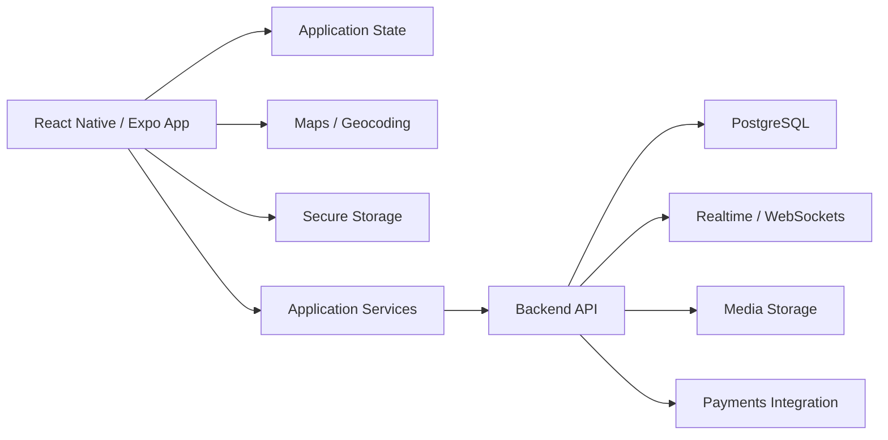

# CarLink

> **Public project showcase.** The implementation remains private while this repository documents the product vision and engineering work.

## Overview

**CarLink** is a mobile product that combines **carpooling** with **professional networking**.

The concept is designed for students, graduates and young professionals who can share routes while building trusted professional connections.

> **Connect. Share. Move Forward.**

## Product Areas

- User onboarding and authentication
- Driver and passenger profiles
- Ride discovery
- Trip workflows
- Professional profiles
- Networking interactions
- Ratings and trust signals
- Chat and communication
- Maps and geocoding
- Events and social interactions
- Secure local authentication storage

## Architecture

## Technology

| Area | Technologies |
|---|---|
| Mobile | React Native · Expo |
| Navigation | React Navigation |
| State | Zustand |
| HTTP | Axios |
| Local Storage | AsyncStorage · SecureStore |
| Maps | Leaflet · OpenStreetMap / Nominatim |
| Testing | Jest |
| Planned Production Backend | Node.js · PostgreSQL · Prisma |

## Implemented Mobile Work

The private MVP includes work around:

- animated splash and onboarding flows
- authentication screens
- multi-step registration
- reusable UI components
- design tokens
- user-profile workflows
- map/location experiences
- persisted application state

## Engineering Focus

CarLink is useful in my portfolio because it demonstrates a different engineering dimension from my data/IoT work:

- consumer mobile UX
- product architecture
- state management
- location-aware interfaces
- secure device storage
- component reuse
- mobility-domain product thinking

## Project Status

**MVP / active development.**

The production backend, payments and external integrations are represented as architecture targets where they are not yet production-complete.

## Repository Strategy

The source repository remains private to protect implementation details and future product work.

## More Documentation

[Architecture notes](./docs/ARCHITECTURE.md)

---

**Private source repository · Public mobility-product case study**
