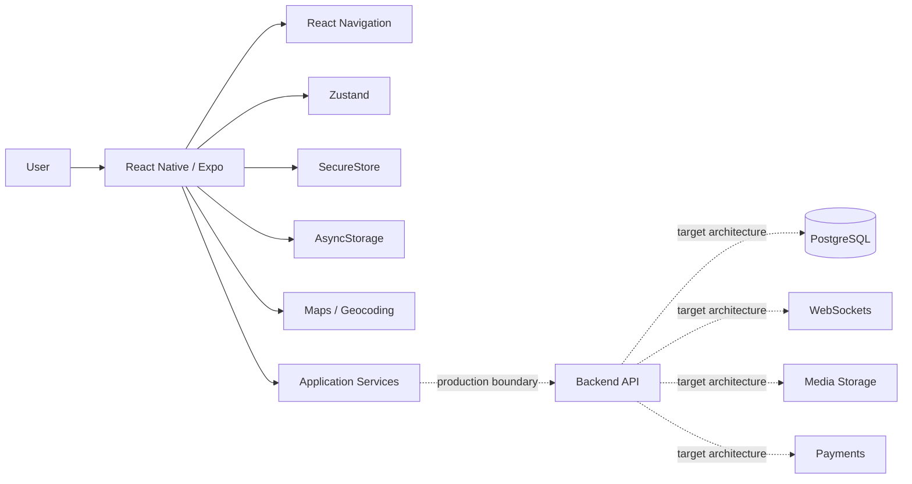

# CarLink

### Carpooling · Professional Networking · Mobile Product

**Public engineering showcase — application source remains private**

[Architecture](./docs/ARCHITECTURE.md) · [Project status](./docs/STATUS.md)

---

## Overview

**CarLink** is a mobile product concept that combines **shared mobility** with **professional networking**.

The private MVP focuses on the mobile experience: onboarding, identity/profile flows, location-aware interfaces, reusable UI, persisted state and the foundations for ride and networking workflows.

> **Connect. Share. Move Forward.**

## Product Idea

Traditional carpooling focuses on getting from A to B. CarLink explores an additional layer: helping students, graduates and young professionals share routes while building trusted professional connections.

## Current Mobile Scope

The private application contains work around:

- animated splash and onboarding
- login and registration
- multi-step profile creation
- driver/passenger preferences
- professional profile information
- reusable UI components
- application-wide design tokens
- maps/geocoding
- persistent application state
- secure token storage
- location-aware experiences
- notifications/media integration paths
- Jest-based tests and coverage tooling

## Architecture

The dotted backend paths represent the **production architecture direction**, not a claim that every backend integration is already production-ready.

## Technology

| Area | Technologies |
|---|---|
| Mobile | React Native 0.81 · Expo SDK 54 |
| Navigation | React Navigation |
| State | Zustand |
| HTTP | Axios |
| Local persistence | AsyncStorage |
| Sensitive storage | Expo SecureStore |
| Location | Expo Location |
| Maps | React Native Maps · Leaflet/WebView · OpenStreetMap/Nominatim |
| Media | Expo AV · Image Picker |
| Testing | Jest · jest-expo |
| Quality | ESLint · coverage tooling |

## Mobile Engineering Highlights

### Reusable Design System

The private project includes shared components and design constants for buttons, inputs, cards, avatars, loading/empty states, spacing, typography and theme behavior.

### Authentication UX

The MVP includes login and registration flows, including a multi-step registration experience with professional-profile information and preference capture.

### Maps & Geocoding

The project includes location/map dependencies and OpenStreetMap/Nominatim-oriented geocoding work, with attribution and rate-limit/cache considerations documented in the private repo.

### Secure Device State

General persistence and authentication material are separated: sensitive tokens use SecureStore rather than general application persistence.

### Quality Tooling

The private project exposes lint, test and coverage commands and is structured for CI validation.

## Engineering Boundary: Implemented vs. Planned

The mobile MVP is the strongest implemented portion of the project.

A production backend architecture is documented around Node.js/NestJS, PostgreSQL/Prisma, OAuth, realtime messaging, payments and media storage, but those integrations should be treated as **production targets unless explicitly validated in the private project**.

## Current Status

**MVP / active development.**

Core onboarding/authentication/design-system work is implemented. Several product areas—full ride workflows, chat, events, wallet/payments and production backend integrations—remain in development or architecture planning.

[See the explicit status matrix →](./docs/STATUS.md)

## Why the Source Is Private

The private repository contains future product work, mobile implementation details and environment configuration that are intentionally not published.

---

### What this project demonstrates

**Mobile UX engineering · product architecture · location-aware interfaces · secure device storage · reusable component design · mobility-domain thinking**
