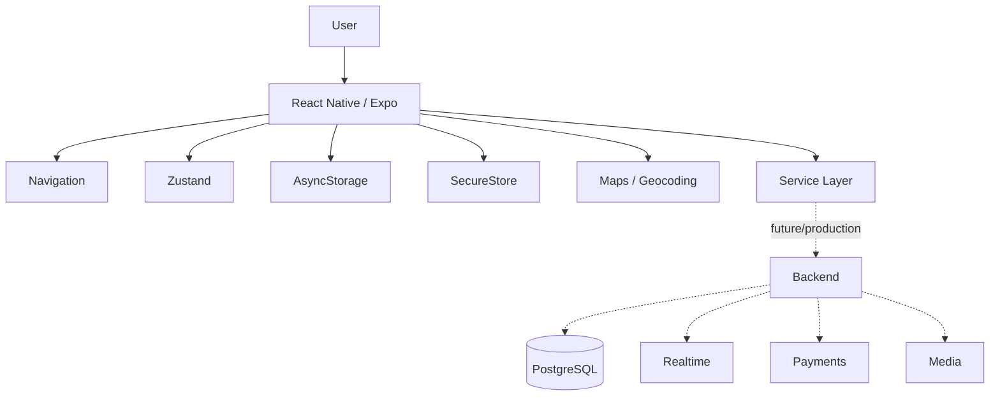

# CarLink — Architecture

## 1. Current Architectural Center

CarLink is currently strongest as a mobile MVP. The public showcase therefore separates the implemented mobile layer from the production backend direction.

## 2. Mobile Layer

The application uses:

- React Native / Expo
- React Navigation
- Zustand
- AsyncStorage
- SecureStore
- Axios
- location/map tooling
- Jest

## 3. State Boundaries

### General application state

Persisted through normal client-side state/storage mechanisms.

### Sensitive authentication material

Stored separately using SecureStore.

This separation reduces the risk of treating all local state as equally sensitive.

## 4. Location Layer

The private project contains map/geocoding work and documents OpenStreetMap/Nominatim attribution, caching and rate-limit considerations.

## 5. Production Backend Direction

The private README describes a target architecture with:

- Node.js / Express or NestJS
- PostgreSQL + Prisma
- JWT / OAuth
- WebSockets
- payments
- media/object storage

Those items are represented in this showcase as architectural direction, not automatically as completed production services.

## 6. Diagram

## 7. Design Principle

The showcase avoids presenting planned backend integrations as completed implementation. The mobile product work is documented separately from production targets.
