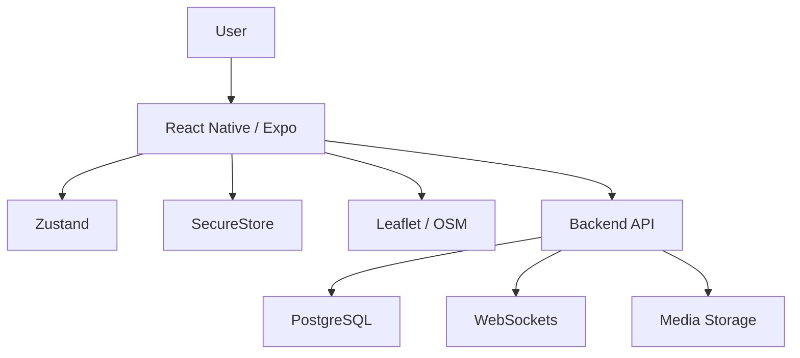

# CarLink — Architecture Notes

## Product Layers

1. **Mobile Experience** — onboarding, profiles, trips, networking.
2. **Location Layer** — maps and geocoding.
3. **State / Storage** — app state and secure device data.
4. **Backend Boundary** — future/production service integrations.

## Logical Flow

## Design Considerations

- Consumer mobile UX is the primary product surface.
- Location and route experiences are core capabilities.
- Sensitive authentication state is separated from general local persistence.
- The MVP distinguishes implemented mobile work from planned production services.
